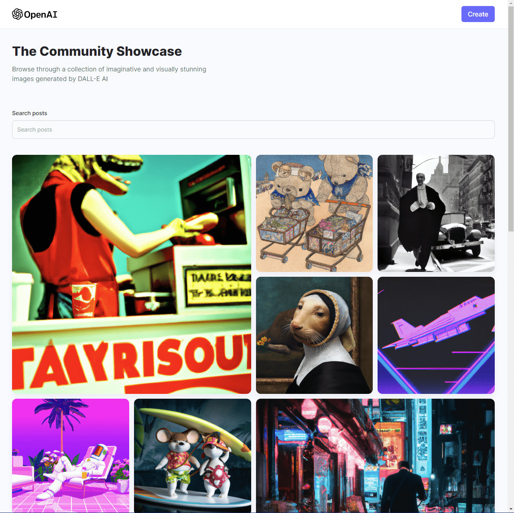
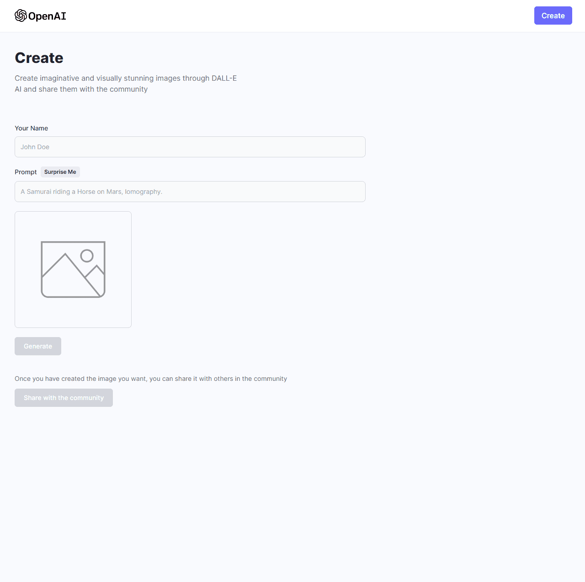

AI Image Generation and Sharing App
===================================

[Live Website](https://utkarsh-ai-image-generation-sharing.netlify.app/)

Discover the forefront of image generation with the AI-powered application that seamlessly merges the innovation of OpenAI's DALL-E 2 Model with the capabilities of a full stack MERN (MongoDB, Express, React, Node.js) application.  

DALL-E 2 marks a leap in artificial intelligence, crafting vivid images and art based on natural language descriptions. Through text, this AI system can synthesize original and realistic visuals, incorporating concepts, attributes, and styles. This application provides a user-friendly interface for harnessing DALL-E 2's creative prowess.  

Built on the MERN stack, the full-stack architecture guarantees robustness and versatility. MongoDB ensures efficient data storage, Express powers seamless communication, React crafts a responsive frontend, and Node.js orchestrates the backend operations.  

With this platform, users can input descriptive text and witness the magic of DALL-E 2 translating words into captivating imagery. Additionally, the application empowers users to share these AI-generated images, fostering a dynamic and collaborative experience.  

In summary, the AI Image Generation and Sharing application converges the cutting-edge DALL-E 2 Model with a powerful MERN stack, revolutionizing the way we create, explore, and interact with AI-generated visuals.  

  

  